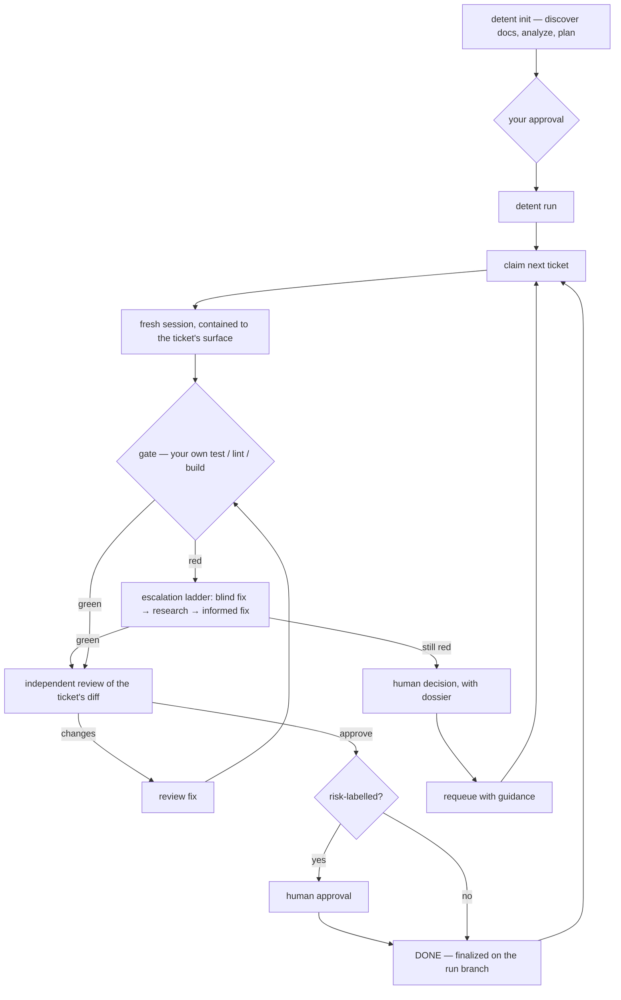

# Detent

[](https://github.com/AmineYagoub/detent/actions/workflows/ci.yml)
[](https://github.com/AmineYagoub/detent/releases)
[](LICENSE)
[](.github/workflows/ci.yml)
[](docs/release-checklist.md)

Detent turns planning documents into merged, reviewed, test-gated code using
fresh, single-purpose Claude Code sessions whose every consequential move is
admitted by a deterministic referee.

Planning tools — spec-kit, Superpowers, BMAD and their peers — write excellent
documents. Those documents are Detent's *input*. Detent is the referee
underneath that layer: it makes the run auditable, budgeted, and contained,
whichever way the plan was written.

- **An auditable state machine** — every admitted transition is journaled to
  `transitions.jsonl`; the run's ground truth is never a chat log.
- **Hard budgets** — attempt and spend ceilings you set yourself; a ceiling
  never auto-retries, it presents a human decision.
- **Verification bound to your project, with drift halts** — Detent executes
  your repo's own test/lint/build commands, and halts for re-baselining if
  they change mid-run.
- **Per-ticket write containment** — a deny-enforced hook holds every session
  inside its ticket's declared surface; allow-rules cannot shadow it.

Detent maintains itself under the same rules: the N-7 self-build gate —
Detent building its own walking skeleton from its own PRD — is a permanent
release requirement, not a demo.

## Install

```bash
claude plugin marketplace add AmineYagoub/detent
```

```bash
claude plugin install detent@detent
```

For development, load the checkout with `claude --plugin-dir /path/to/detent`.
The headless driver is the same referee under a deterministic loop, for CI
and unattended runs.

## The golden path

Two commands. That is the whole public workflow.

```bash
detent init
```

```bash
detent run
```

`init` discovers your planning documents and verification entrypoints,
generates an implementation plan as tickets, and obtains your approval.
`run` executes the approved plan. Both resume from checkpoints when re-run,
and every stop tells you exactly what it needs before picking up where it
left off.



Every arrow above is a referee-admitted transition, journaled to
`transitions.jsonl`. Budgets are evaluated at session launch; a breached
ceiling routes to a human, never to a retry.

## What Detent will never do

- Write to your base branch — work happens on a `detent/run-<id>` branch.
- Transition on a claim — only artifacts and exit codes move a ticket forward.
- Redefine a gate mid-run — if a verification command changes in flight,
  Detent halts and asks you to re-baseline.
- Own your tooling — `.detent/` never contains your project's configuration.

## Exit codes

`run` exit codes are public API:

| Code | Meaning |
|---|---|
| `0` | plan complete |
| `10` | human-gated items remain |
| `2` | not ready (no or unapproved plan, binding drift) |
| `1` | error |

## Plumbing

Documented, scriptable, and never required on the golden path:
`detent status`, `detent report`, `detent doctor`, `detent approve <id>`,
`detent requeue <id>`, `detent verify sync`.

## License

[MIT](LICENSE).
