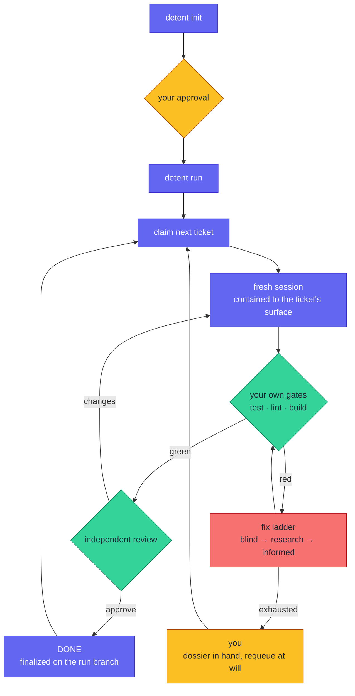

# Detent

[](https://github.com/AmineYagoub/detent/actions/workflows/ci.yml)
[](https://github.com/AmineYagoub/detent/releases)
[](LICENSE)
[](.github/workflows/ci.yml)
[](docs/release-checklist.md)

Detent turns planning documents into merged, reviewed, test-gated code using
fresh, single-purpose Claude Code sessions whose every consequential move is
admitted by a deterministic referee.

Planning tools (spec-kit, Superpowers, BMAD and their peers) write excellent
documents. Those documents are Detent's *input*. Detent is the referee
underneath that layer: it makes the run auditable, budgeted, and contained,
whichever way the plan was written.

- **An auditable state machine**: every admitted transition is journaled to
  `transitions.jsonl`; the run's ground truth is never a chat log.
- **Hard budgets**: attempt and spend ceilings you set yourself; a ceiling
  never auto-retries, it presents a human decision.
- **Verification bound to your project, with drift halts**: Detent executes
  your repo's own test/lint/build commands, and halts for re-baselining if
  they change mid-run.
- **Per-ticket write containment**: a deny-enforced hook holds every session
  inside its ticket's declared surface; allow-rules cannot shadow it.

Detent maintains itself under the same rules: the N-7 self-build gate,
Detent building its own walking skeleton from its own PRD, is a permanent
release requirement, not a demo.

## Install

```bash
claude plugin marketplace add AmineYagoub/detent
```

```bash
claude plugin install detent@detent
```

For development, load the checkout with `claude --plugin-dir /path/to/detent`.
The headless driver is the same referee under a deterministic loop, for CI
and unattended runs.

## The golden path

Two commands. That is the whole public workflow.

```bash
detent init
```

`init` runs seven phases, in order:

- **INIT_FS**: checks you're at a git root and scaffolds `.detent/`.
- **DISCOVER**: finds your planning documents and candidate verification commands.
- **ANALYZE**: reads the documents and summarizes what's being built; batches any question they can't answer into one round.
- **DETERMINE_VERIFICATION**: probes candidate test/lint/build commands and binds the ones that actually run.
- **PLAN**: derives tickets with acceptance criteria, surfaces, and dependencies.
- **PREPARE_AGENTS**: assigns roles and, where configured, models per ticket.
- **PRESENT**: shows you the bindings and plan, and stops for your approval.

```bash
detent run
```



Amber is you; indigo is the machine's moves; green is verification; red is
the fix ladder. Every arrow is a referee-admitted transition, journaled to
`transitions.jsonl`. Budgets are evaluated at session launch and a breached
ceiling routes to a human, never to a retry; a risk-labelled ticket takes
one extra stop at your approval before DONE.

## Works with existing and new projects

**Existing projects** are the primary case, however far along: Detent binds
to the repo's own verification commands, plans from your planning documents,
and works on a run branch: the existing code and history are read, never
rewritten. Scope the document to the work that REMAINS; the generated
tickets are presented for your approval before anything runs, and they are
editable: prune any the codebase already satisfies. If a stale ticket
slips through, the session discovers the premise is already met, signals it,
and stops rather than writing duplicate code. Start from a green suite:
gates run your own commands, and pre-existing failures would be blamed on
the first ticket. Plan increment by increment: an approved plan stays
frozen, and `detent init --replan` starts the next one.

**New projects** need only a folder containing the planning document:
Detent derives the stack, scaffolds through its own bootstrap ticket, and
builds from nothing. That path is the permanent release gate: every Detent
release must build Detent's own walking skeleton from its own PRD.

## What Detent will never do

- Write to your base branch: work happens on a `detent/run-<id>` branch.
- Transition on a claim: only artifacts and exit codes move a ticket forward.
- Redefine a gate mid-run: if a verification command changes in flight,
  Detent halts and asks you to re-baseline.
- Own your tooling: `.detent/` never contains your project's configuration.

## Exit codes

`run` exit codes are public API:

| Code | Meaning |
|---|---|
| `0` | plan complete |
| `10` | human-gated items remain |
| `2` | not ready (no or unapproved plan, binding drift) |
| `1` | error |

## Plumbing

Documented, scriptable, and never required on the golden path:
`detent status`, `detent report`, `detent doctor`, `detent approve <id>`,
`detent requeue <id>`, `detent unclaim <id>`, `detent verify sync`.

## License

[MIT](LICENSE).
