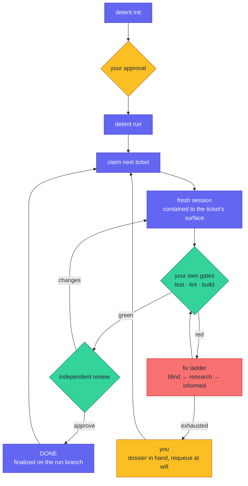

# Detent

[](https://github.com/AmineYagoub/detent/actions/workflows/ci.yml)
[](https://github.com/AmineYagoub/detent/releases)
[](LICENSE)
[](.github/workflows/ci.yml)
[](docs/release-checklist.md)

Detent turns planning documents into merged, reviewed, test-gated code using
fresh, single-purpose Claude Code sessions whose every consequential move is
admitted by a deterministic referee.

Planning tools (spec-kit, Superpowers, BMAD and their peers) write excellent
documents. Those documents are Detent's *input*. Detent is the referee
underneath that layer: it makes the run auditable, budgeted, and contained,
whichever way the plan was written.

- **An auditable state machine**: every admitted transition is journaled to
  `transitions.jsonl`; the run's ground truth is never a chat log.
- **Hard budgets**: attempt and spend ceilings you set yourself; a ceiling
  never auto-retries, it presents a human decision.
- **Verification bound to your project, with drift halts**: Detent executes
  your repo's own test/lint/build commands, and halts for re-baselining if
  they change mid-run.
- **Per-ticket write containment**: a deny-enforced hook holds every session
  inside its ticket's declared surface; allow-rules cannot shadow it.

Detent maintains itself under the same rules: the N-7 self-build gate,
Detent building its own walking skeleton from its own PRD, is a permanent
release requirement, not a demo.

## Install

```bash
claude plugin marketplace add AmineYagoub/detent
```

```bash
claude plugin install detent@detent
```

For development, load the checkout with `claude --plugin-dir /path/to/detent`.
The headless driver is the same referee under a deterministic loop, for CI
and unattended runs.

## The golden path

Two commands. That is the whole public workflow.

```bash
detent init
```

`init` runs twelve phases, in order. On a terminal it asks you DECIDE's questions as it goes, and otherwise it stops between them only where VALIDATE cannot go on without you:

- **INIT_FS**: checks you're at a git root and scaffolds `.detent/`.
- **DISCOVER**: finds your planning documents and candidate verification commands.
- **AUDIT**: reads the documents before anything plans from them. It finds passages that contradict each other, gaps a plan would need filled, and, in an existing project, what the documents say is built that the code does not do. It checks every external claim they rely on, such as a library's behaviour at the version you pin, against a primary source. It prints what it found, and DECIDE settles it.
- **DECIDE**: settles what AUDIT left open before anything plans from it. A decision counted in money or contracts is asked, in screens of at most four, the recommended answer first and each option with what choosing it means; everything else is settled as a default you can veto. Both go into `docs/founder-decisions.md`, the decision log, which every later phase reads, and a question the log already answers is not asked again. Off a terminal it takes each recommended answer and says so. In a new project it also decides the stack.
- **WRITE**: rewrites the documents into the pack, a fixed layout under `docs/` in which every requirement has an id, a milestone and MUST or SHOULD, every acceptance criterion states Given, When and Then, and every decision and default the pack relies on is cited by id. It moves each original it rewrote to `archive/` and deletes nothing; a README stays where it is. The pack checker checks what it wrote, its session is relaunched once on a blocking finding, and the result, red or green, goes into `docs/conformance.json`, which says the pack is not validated yet.
- **VALIDATE**: validates the pack before anything plans from it. A red pack checker is fixed first. Then each round runs one reviewer per area of the pack, the areas your index names, and each finding comes with its severity, blocker, major or minor, its `file:line`, a quote and the exact fix; a writer applies them, and the next round checks those fixes and what they broke. A round with no blocker and no major ends it, its minor findings fixed. `spec_validation_rounds` (default 8) is the ceiling: there, the majors left go to PRESENT as risks and planning goes on, and a blocker stops `init` for you to settle, after which `detent init` carries on where it stopped. A checker it cannot make green stops `init` too. Every round's counts and what it left open go into `docs/conformance.json`. An edit to a validated pack is re-validated for the edit and whatever cites it. The phases after it plan from the pack.
- **ANALYZE**: reads the documents and summarizes what's being built; every question they can't answer is noted with the assumption planning proceeds on.
- **DETERMINE_VERIFICATION**: probes candidate test/lint/build commands and binds the ones that actually run.
- **SLICE**: cuts the whole product into ordered increments — walking skeleton first — and places a production baseline (secrets, auth, backups, health checks, CI gates, …) in the slice where each item belongs, whether or not your documents asked for it.
- **PLAN**: plans every slice in turn into tickets with acceptance criteria, surfaces, and dependencies; each slice is reviewed as its own plan, then the whole plan is reviewed for coherence against your documents.
- **PREPARE_AGENTS**: assigns roles and, where configured, models per ticket.
- **PRESENT**: shows you the slices, the plan, every default the decision log holds, every risk VALIDATE left open, and every open question with its assumption — once, at the end — and stops for your answers and approval. To veto a default, edit its row in the log and run `detent init` again.

```bash
detent run
```


```mermaid
flowchart TD
    I["detent init"] --> A{"your approval"}
    A --> R["detent run"]
    R --> C["claim next ticket"]
    C --> S["fresh session<br>contained to the ticket's surface"]
    S --> G{"your own gates<br>test · lint · build"}
    G -- green --> V{"independent review"}
    G -- red --> L["fix ladder<br>blind → research → informed"]
    L --> G
    L -- exhausted --> H["you<br>dossier in hand, requeue at will"]
    H --> C
    V -- changes --> S
    V -- approve --> D["DONE<br>finalized on the run branch"]
    D --> C

    classDef you fill:#fbbf24,stroke:#b45309,color:#1f2937
    classDef machine fill:#6366f1,stroke:#4338ca,color:#ffffff
    classDef verify fill:#34d399,stroke:#047857,color:#1f2937
    classDef ladder fill:#f87171,stroke:#b91c1c,color:#1f2937
    class A,H you
    class I,R,C,S,D machine
    class G,V verify
    class L ladder
```

Amber is you; indigo is the machine's moves; green is verification; red is
the fix ladder. Every arrow is a referee-admitted transition, journaled to
`transitions.jsonl`. Budgets are evaluated at session launch and a breached
ceiling routes to a human, never to a retry; a risk-labelled ticket takes
one extra stop at your approval before DONE.

## Works with existing and new projects

**Existing projects** are the primary case, however far along: Detent binds
to the repo's own verification commands, plans from your planning documents,
and works on a run branch: the existing code and history are read, never
rewritten. Scope the document to the work that REMAINS; the generated
tickets are presented for your approval before anything runs, and they are
editable: prune any the codebase already satisfies. If a stale ticket
slips through, the session discovers the premise is already met, signals it,
and stops rather than writing duplicate code. Start from a green suite:
gates run your own commands, and pre-existing failures would be blamed on
the first ticket. Plan increment by increment: an approved plan stays
frozen, and `detent init --replan` starts the next one.

**New projects** need only a folder containing the planning document:
Detent derives the stack, scaffolds through its own bootstrap ticket, and
builds from nothing. That path is the permanent release gate: every Detent
release must build Detent's own walking skeleton from its own PRD.

## What Detent will never do

- Write to your base branch: work happens on a `detent/run-<id>` branch.
- Transition on a claim: only artifacts and exit codes move a ticket forward.
- Redefine a gate mid-run: if a verification command changes in flight,
  Detent halts and asks you to re-baseline.
- Own your tooling: `.detent/` never contains your project's configuration.

## Exit codes

`run` exit codes are public API:

| Code | Meaning |
|---|---|
| `0` | plan complete |
| `10` | human-gated items remain |
| `2` | not ready (no or unapproved plan, binding drift) |
| `1` | error |

## Your working tree

During a run Detent works in a per-ticket git worktree under
`.detent/worktrees/`, merged `--no-ff` into the run branch when the ticket is
done — never into your base branch. Your own checkout is left alone.

`--no-worktree` runs in your checkout instead. Say so deliberately: in that mode
Detent resets uncommitted tracked changes at resume, moves untracked files it
does not own aside, and stages the tree when a ticket finalizes. Those are the
right behaviours for a tree Detent owns and the wrong ones for yours.

## Plumbing

Documented, scriptable, and never required on the golden path:
`detent status`, `detent report`, `detent doctor`, `detent approve <id>`,
`detent requeue <id>`, `detent unclaim <id>`, `detent verify sync`.

## License

[MIT](LICENSE).
